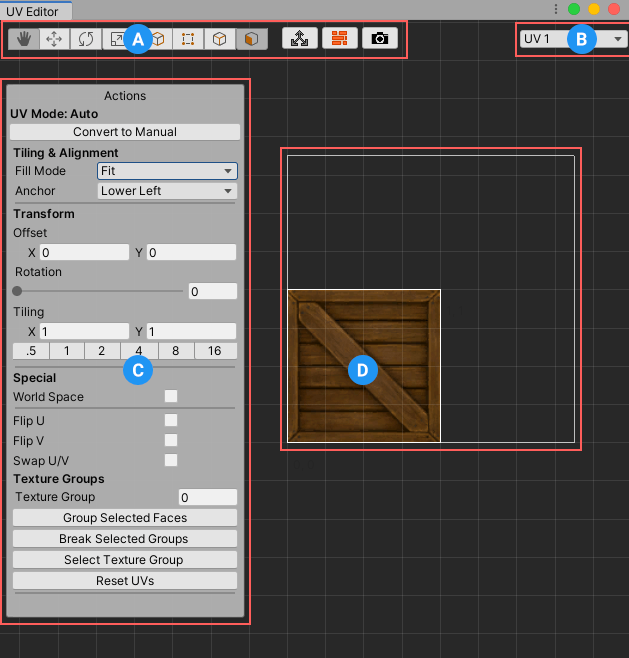
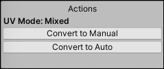

#  UV Editor window

Use this window to manage texture mapping on the selected Mesh.

To open this window, navigate to the [ProBuilder toolbar](toolbar.md) and click the **UV Editor** button (  ).

> **Tip:** You can also access this window from the ProBuilder menu (**Tools** > **ProBuilder** > **Editors** > **Open UV Editor**).

**(A)** The [UV Editor toolbar](uv-editor-toolbar.md) contains general features for working with UVs.

**(B)** The [UV drop-down menu](uv_dropdown.md) allows you to switch between UV channels:

* Choose **UV** to edit the UV mapping for shaders.
* Choose **UV2 (read-only)** to regenerate your baked or realtime lightmaps.

**(C)** The **Actions** panel is a dynamic panel, similar to the [ProBuilder toolbar](toolbar.md):

* What kind of UVs you are editing (shader UVs or lightmap UV2s) determine which set of options appear in the panel. 
* For shader UV options, you can switch between using manual UV editing or auto-texturing, and these each have their own specific options as well. For more information, see [UV editing modes](#uv-modes).
* Only actions compatible with the selected UV element type (vertex, edge, face) are available. If you are in object selection mode when you open the UV Editor, all options are disabled: you must select one or more faces, edges, or vertices to continue.

**(D)** You can use the UV viewer to view and edit the selected object's UV elements directly.

> **Tip**: While working in the UV viewer's work area (canvas), sometimes the Texture becomes only partially visible (for example, if you zoomed in so you could see more detail on the Texture). To quickly re-center the Texture, use the **0** shortcut. You can also re-map this shortcut with the Shortcuts Manager.

## UV editing modes

The UV Editor supports two modes when you edit texture mapping:

* [Automatic](auto-uvs-actions.md) : ProBuilder manages the texture mapping according to the settings in the [Actions panel](auto-uvs-actions.md) automatically, even when you resize the Mesh. This is the default. Use this mode for simple texturing work, especially architectural or hard-surface items. Tiling, Offset, Rotation, and other controls are available, while ProBuilder automatically manages the projection and updates it as you modify the Mesh geometry.

	For example, use automatic tiling to for a brick texture on a wall. This maintains the size and orientation of the brick even if you resize the wall. Textures like brick with a repeating pattern are ideal for automatic mode.

* [Manual](manual-uvs-actions.md) : Use the UV Editor to precisely unwrap and edit UVs, render UV Templates, project UVs, and more. To modify the texture mapping, you move, rotate, and resize the UV elements against the Texture in the viewer. ProBuilder provides two texture projection methods (**Box** and **Planar**), along with several helpers in the [Actions panel](manual-uvs-actions.md) to help you select and edit elements.

	For example, you can use a texture image for an element with details like a building where some areas contain windows or doors. Using the Manual mode in these cases is ideal, because you can position the UV elements precisely against the image.

Each face supports only one mode at a time, but you can use a mixture of the two modes on the same Mesh. This is especially useful when some parts of a Model need to have tiling Textures, while others are unwrapped. If you select several faces at once, and some are in Automatic mode and others are in Manual, the Actions panel displays both buttons: __Convert to Manual__ and __Convert to Auto__.

